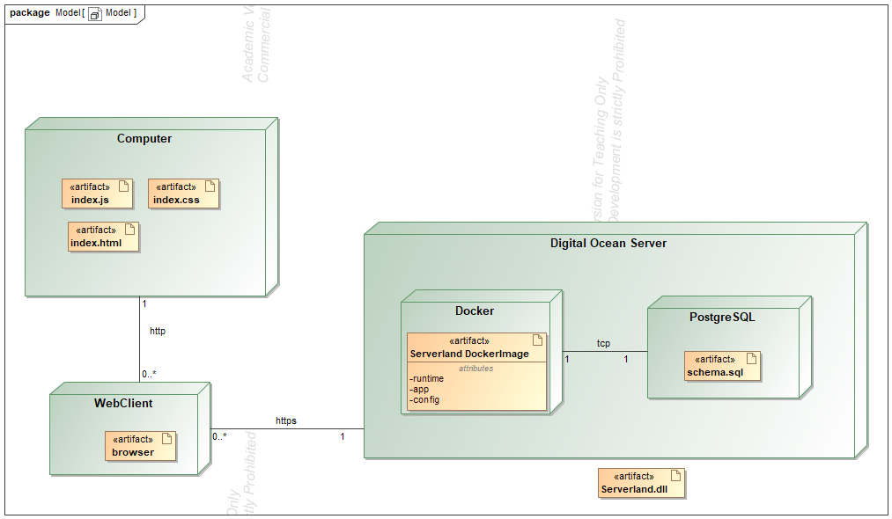
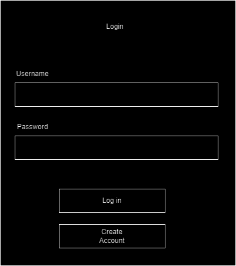
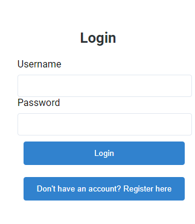
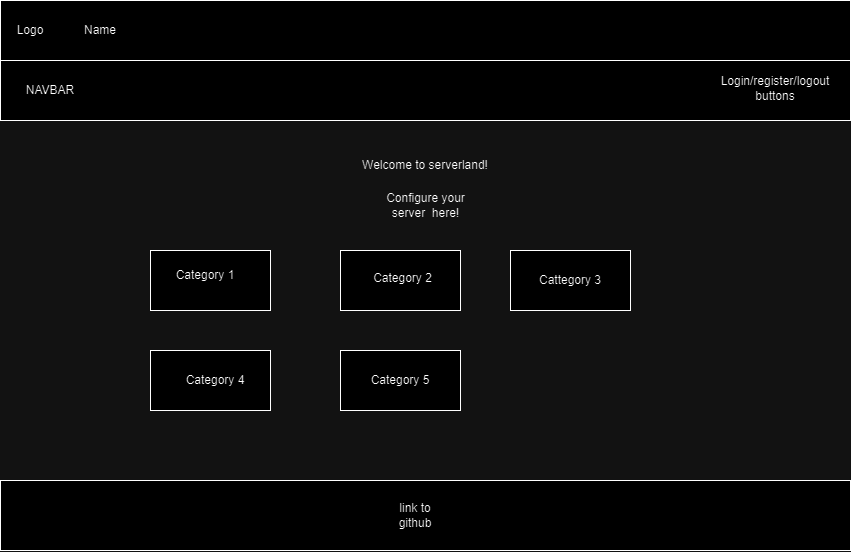
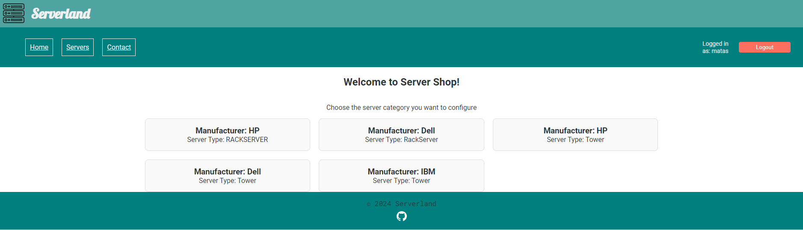
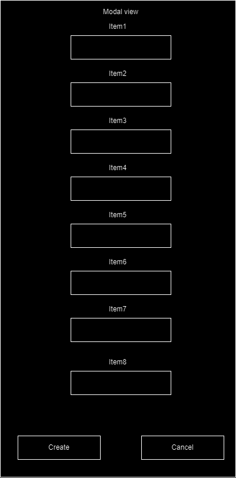
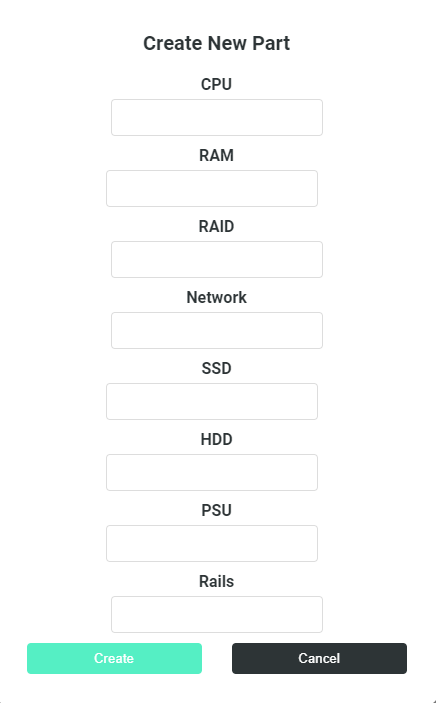

# SERVERLAND
 Saityno taikomųjų programų projektavimo kurso projektas
<hr/>

# Pasirinktų technologijų aprašymas
<p>    DB sprendimas - PostgreSQL</p>
<P>    Backend - .NET 8 su Entity Framework DB interakcijai</p>
<p>    Frontend - React su Node.js</p>


<hr/>

# Sistemos paskirtis

Internetinė svetainė skirta užsisakyti/susirinkti serverį pagal savo norus
<hr/>

# Funkciniai reikalavimai
<p> Svečias gali peržiūrėti serverius ir kategorijas <p>
<p>Klientas gali peržiūrėti serverius, kategorijas ir dalis. Gali sukurti nauja dalį, updatinti ir ištrinti</p>
<p>Administratorius gal administruoti svetaine (blokuoti, trinti, sekti informacija t.t.) gali viską daryti</p>
<hr/>

# Sistemos architektūra



<hr/>

# Naudotojo sąsaja














<hr/>

# API Dokumentacija: SERVERLAND

## Aprašymas
SERVERLAND API leidžia valdyti kategorijas, serverius ir jų dalis. Ši API specifikacija pateikta naudojant OpenAPI 3.0.3. Žemiau aprašomi galimi API endpoint'ai, jų veikimo principai, bei atsako kodai su pavyzdžiais.

## API Bazinis URL
```
https://api.server.test/v1
```

## Endpoints

### 1. Category

#### 1.1. Gauti visų kategorijų sąrašą
- **Endpoint:** `/category`
- **Metodas:** GET
- **Atsako kodai:**
  - `200`: Pateikiamas kategorijų sąrašas.

**Pavyzdys:**
```json
Atsakymas (200):
[
  {
    "id": 1,
    "manufacturer": "Dell",
    "type": "Tower"
  },
  {
    "id": 2,
    "manufacturer": "HPE",
    "type": "Rack"
  }
]
```

#### 1.2. Sukurti naują kategoriją
- **Endpoint:** `/category`
- **Metodas:** POST
- **Atsako kodai:**
  - `201`: Kategorija sukurta sėkmingai.
  - `400`: Klaidinga užklausa.
  - `422`: Nepavyko apdoroti pateiktos informacijos.

**Pavyzdys:**
```json
Užklausa:
{
  "manifacturer": "Dell",
  "serverType": "Rack"
}

Atsakymas (201):
{
  "id": 3,
  "manifacturer": "Dell",
  "serverType": "Rack"
}
```

#### 1.3. Gauti kategoriją pagal ID
- **Endpoint:** `/category/{categoryId}`
- **Metodas:** GET
- **Atsako kodai:**
  - `200`: Pateikiama kategorija.
  - `404`: Kategorija nerasta.

**Pavyzdys:**
```json
Atsakymas (200):
{
  "id": 1,
  "manufacturer": "Dell",
  "type": "Tower"
}
```

#### 1.4. Atnaujinti kategoriją pagal ID
- **Endpoint:** `/category/{categoryId}`
- **Metodas:** PUT
- **Atsako kodai:**
  - `200`: Kategorija atnaujinta sėkmingai.
  - `400`: Klaidinga užklausa.
  - `404`: Kategorija nerasta.
  - `422`: Nepavyko apdoroti pateiktos informacijos.

**Pavyzdys:**
```json
Užklausa:
{
  "description": "Updated description"
}

Atsakymas (200):
{
  "id": 1,
  "manufacturer": "Dell",
  "type": "Tower",
  "description": "Updated description"
}
```

#### 1.5. Ištrinti kategoriją pagal ID
- **Endpoint:** `/category/{categoryId}`
- **Metodas:** DELETE
- **Atsako kodai:**
  - `204`: Kategorija ištrinta.
  - `404`: Kategorija nerasta.

---

### 2. Server

#### 2.1. Gauti serverių sąrašą pagal kategorijos ID
- **Endpoint:** `/category/{categoryId}/server`
- **Metodas:** GET
- **Atsako kodai:**
  - `200`: Pateikiamas serverių sąrašas.

**Pavyzdys:**
```json
Atsakymas (200):
[
  {
    "id": 1,
    "model": "PowerEdge R740xd",
    "disk_count": 16,
    "generation": "14th",
    "weight": 45.25,
    "os": true
  },
  {
    "id": 2,
    "model": "HPE ProLiant DL380",
    "disk_count": 8,
    "generation": "11th",
    "weight": 38.5,
    "os": false
  }
]
```

#### 2.2. Sukurti naują serverį
- **Endpoint:** `/category/{categoryId}/server`
- **Metodas:** POST
- **Atsako kodai:**
  - `201`: Serveris sukurtas sėkmingai.
  - `400`: Klaidinga užklausa.
  - `422`: Nepavyko apdoroti pateiktos informacijos.

**Pavyzdys:**
```json
Užklausa:
{
  "model": "HPE ProLiant DL380",
  "disk_count": 8,
  "generation": "11th",
  "os": false
}

Atsakymas (201):
{
  "id": 3,
  "model": "HPE ProLiant DL380",
  "disk_count": 8,
  "generation": "11th",
  "os": false
}
```

#### 2.3. Gauti serverį pagal ID
- **Endpoint:** `/category/{categoryId}/server/{serverId}`
- **Metodas:** GET
- **Atsako kodai:**
  - `200`: Pateikiamas serveris.
  - `404`: Serveris nerastas.

#### 2.4. Atnaujinti serverį pagal ID
- **Endpoint:** `/category/{categoryId}/server/{serverId}`
- **Metodas:** PUT
- **Atsako kodai:**
  - `200`: Serveris atnaujintas sėkmingai.
  - `400`: Klaidinga užklausa.
  - `404`: Serveris nerastas.
  - `422`: Nepavyko apdoroti pateiktos informacijos.

#### 2.5. Ištrinti serverį pagal ID
- **Endpoint:** `/category/{categoryId}/server/{serverId}`
- **Metodas:** DELETE
- **Atsako kodai:**
  - `204`: Serveris ištrintas.
  - `404`: Serveris nerastas.

---

### 3. Part

#### 3.1. Gauti dalių sąrašą pagal serverio ID
- **Endpoint:** `/category/{categoryId}/server/{serverId}/part`
- **Metodas:** GET
- **Atsako kodai:**
  - `200`: Pateikiamas dalių sąrašas.

**Pavyzdys:**
```json
Atsakymas (200):
[
  {
    "id": 1,
    "cpu": "2 x Intel Xeon Gold 6564",
    "ram": "8 x 32GB DDR4 3200MHz",
    "raid": "H740",
    "network": "FLR360",
    "ssd": "3 x 1.8TB SSD",
    "hdd": "2 x 2TB",
    "psu": "1100W",
    "rails": false
  },
  {
    "id": 2,
    "cpu": "2 x Intel Xeon Gold 6564",
    "ram": "8 x 32GB DDR4 3200MHz",
    "raid": "H740",
    "network": "FLR360",
    "psu": "1100W",
    "rails": true
  }
]
```

#### 3.2. Sukurti naują dalį
- **Endpoint:** `/category/{categoryId}/server/{serverId}/part`
- **Metodas:** POST
- **Atsako kodai:**
  - `201`: Dalis sukurta sėkmingai.
  - `400`: Klaidinga užklausa.
  - `422`: Nepavyko apdoroti pateiktos informacijos.

#### 3.3. Gauti dalį pagal ID
- **Endpoint:** `/category/{categoryId}/server/{serverId}/part/{partId}`
- **Metodas:** GET
- **Atsako kodai:**
  - `200`: Pateikiama dalis.
  - `404`: Dalis nerasta.

#### 3.4. Atnaujinti dalį pagal ID
- **Endpoint:** `/category/{categoryId}/server/{serverId}/part/{partId}`
- **Metodas:** PUT
- **Atsako kodai:**
  - `200`: Dalis atnaujinta sėkmingai.
  - `400`: Klaidinga užklausa.
  - `404`: Dalis nerasta.
  - `422`: Nepavyko apdoroti pateiktos informacijos.

#### 3.5. Ištrinti dalį pagal ID
- **Endpoint:** `/category/{categoryId}/server/{serverId}/part/{partId}`
- **Metodas:** DELETE
- **Atsako kodai:**
  - `204`: Dalis ištrinta.
  - `404`: Dalis nerasta.

---

### Vartotojų autentifikacija

#### Registracija
**POST** `/api/register`

**Atsakymo kodai:**
- `200`: Registracija sėkminga

**Pavyzdys:**

Užklausa:
```http
POST /api/register HTTP/1.1
Host: api.server.test
Content-Type: application/json

{
  "username": "testuser",
  "password": "securepassword"
}
```

Atsakymas:
```json
{
  "message": "User registered successfully"
}
```

#### Prisijungimas
**POST** `/api/login`

**Atsakymo kodai:**
- `200`: Prisijungimas sėkmingas

**Pavyzdys:**

Užklausa:
```http
POST /api/login HTTP/1.1
Host: api.server.test
Content-Type: application/json

{
  "username": "testuser",
  "password": "securepassword"
}
```

Atsakymas:
```json
{
  "accessToken": "eyJhb...",
  "refreshToken": "eyJhb..."
}
```

#### Atnaujinti Access Token
**POST** `/api/accessToken`

**Atsakymo kodai:**
- `200`: Token sėkmingai atnaujintas

**Pavyzdys:**

Užklausa:
```http
POST /api/accessToken HTTP/1.1
Host: api.server.test
Authorization: Bearer <refresh_token>
```

Atsakymas:
```json
{
  "accessToken": "eyJhb..."
}
```

#### Atsijungimas
**POST** `/api/logout`

**Atsakymo kodai:**
- `200`: Atsijungimas sėkmingas

**Pavyzdys:**

Užklausa:
```http
POST /api/logout HTTP/1.1
Host: api.server.test
Authorization: Bearer <access_token>
```

Atsakymas:
```json
{
  "message": "Logged out successfully"
}
```

---


## Komponentai
### Schemos
1. **category**: Kategorijos objektas.
2. **server**: Serverio objektas.
3. **part**: Dalių objektas.

### Atsakymo kodų aprašymai:
- **200**: Sėkminga užklausa, pateikiama reikiama informacija.
- **201**: Sėkmingai sukurta.
- **204**: Ištrinta sėkmingai.
- **400**: Klaidinga užklausa.
- **404**: Nerasta.
- **422**: Nepavyko apdoroti pateiktos informacijos.

<hr/>

# Išvados

<p>Naudotos technologijos yra gerai žinomos ir plačiai taikomos, todėl darbas su jomis buvo gana paprastas. React suteikia prieigą prie daugybės NPM bibliotekų, kurios padėjo lengvai įgyvendinti įvairias funkcijas ir reikalavimus</p>


